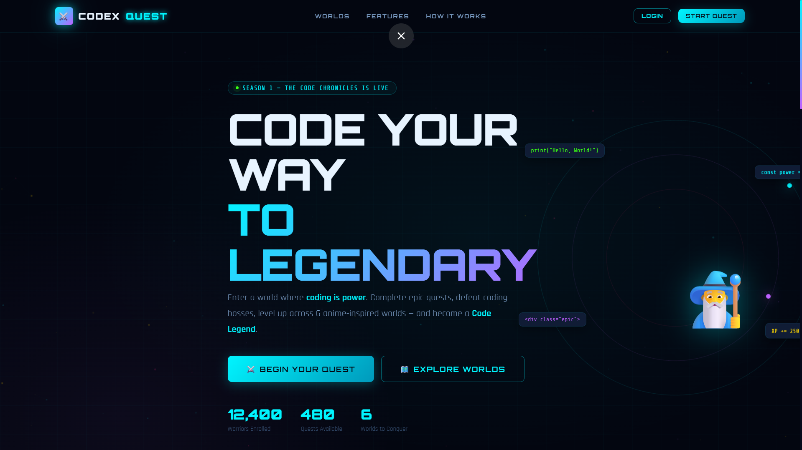
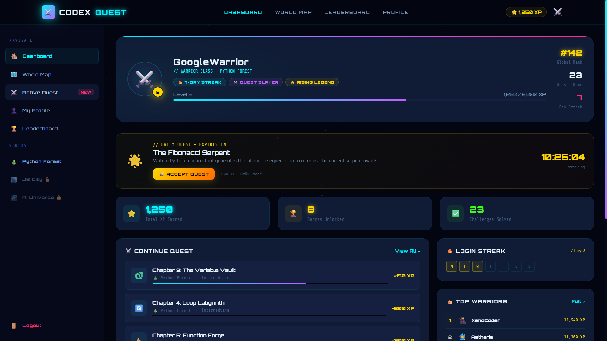
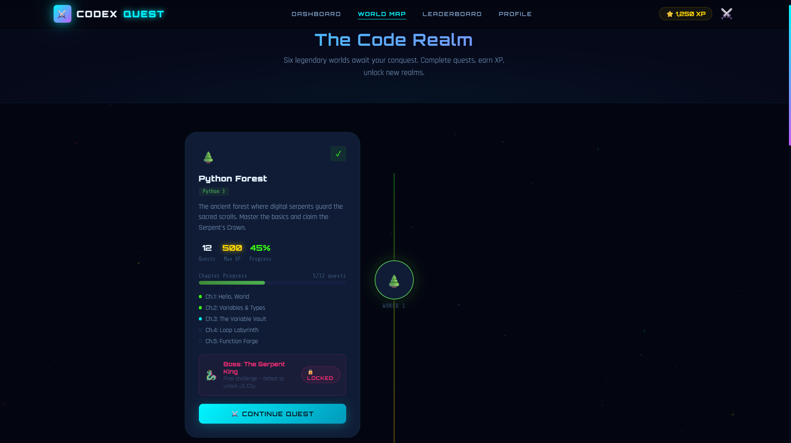
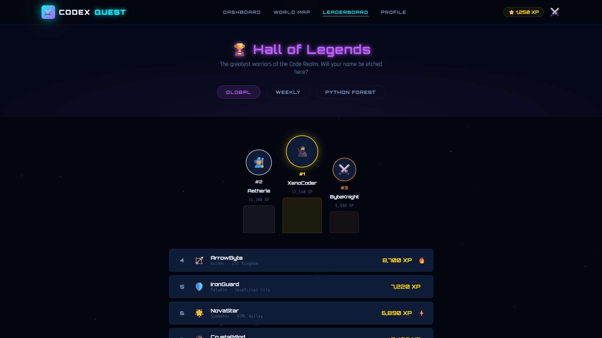
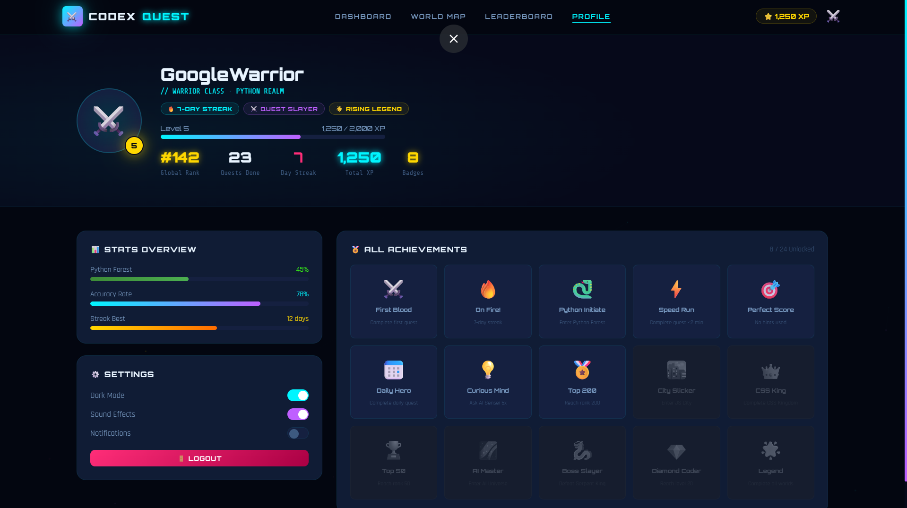

# ⚔️ CodexQuest — Anime Coding RPG

CodexQuest is a **gamified coding learning platform** inspired by RPG games and anime worlds.  
Users complete coding quests, gain XP, unlock worlds, and level up while learning programming.

---

## 🚀 Features

- 🎮 Gamified coding experience
- 🌍 Multiple coding worlds (Python, JavaScript, etc.)
- ⚔️ Quests & boss battles
- ⭐ XP & leveling system
- 🏆 Leaderboard system
- 👤 User profile dashboard
- 🎨 Modern anime-inspired UI
- 📱 Responsive design

---

## 🧠 Concept

CodexQuest transforms learning programming into an **adventure game** where:

- Each programming language = A world
- Each concept = A quest
- Each challenge = A battle
- Progress = XP + Level up

Learning becomes fun, interactive, and engaging.

---

## 🛠️ Built With

- HTML
- CSS
- JavaScript

---

## 📸 Screenshots

### 🏠 Landing Page

### 📊 Dashboard

### 🌍 World Map

### ⚔️ Leaderboard Page

### 👤 Profile

## 🌟 Future Improvements

- Add backend authentication
- Add database for user progress
- Add more worlds
- Add multiplayer leaderboard
- Add real coding challenges

---

## 👩‍💻 Author

**Varshini V**  
CSE Student | Aspiring Developer

---

## ⭐ Show Your Support

If you like this project, consider giving it a ⭐ on GitHub!
